# UART-PROTOCOL
###        Raj Kumar Laldev 
 Advance VLSI Lab   
   Silicon institute of technology Bhubaneswar,India  
       rajbihar5364@gmail.com
 # Table of Contents
 - [Introduction](#Introduction)
   * [Application Background](#Application-Background)
- [UART protocol data flow](#UART-protocol-data-flow)
- [How UART works](#How-UART-works)
   * [Verilog Implementation](#Verilog-Implementation)
   * [Baud rate generate](#Baud-rate-generate)
- [Design of UART transmitter](#Design-of-UART-transmitter)
  * [Transmitter  state machine](#Transmitter-state-machine)
  * [Verilog implementation of state machine](#Verilog-implementation-of-state-machine)
- [Design of UART receiver](#Design-of-UART-receiver)
  * [Receiver state machine](#Receiver-state-machine)
  *  [Verilog implementation of state machine](#Verilog-implementation-of-state-machine)
- [Oversampling procedure](#Oversampling-procedure)
-  [Results](#Results)
-  [Conclusion](#Conclusion)
- [Acknowledgement](#Acknowledgement)
- [References](#References)

# Introduction
Protocol: A set of rules and regulations is called a
protocol. Different type of protocols are available.
1.  Bus protocol: APB,AHB,AXI,ASB,ACE 
2. Peripheral protocol.
- High speed: PCIe, SATA, SAS, Ethernet, USB, MIPI.
- Low speed :UART,SPI,I2C.

    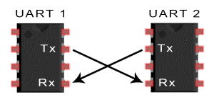

- One of the biggest challenge in SOC design is the on chip communication between the different components.
-  The different bus protocols used for interconnection .
-  Most of the times, the IP cores are designed with many different interfaces and communication protocols and this can be a problem while integrating into an SOC. 
- To avoid this problem, standard on-chip bus structures and protocols were developed. Exchange of information from one system to another system with a medium is called communication.
-  A set of rules and regulations that allow two electronic devices to connect to exchange the data with one and another. 
-  Universal asynchronous receiver-transmitter (UART) is one of the simplest and oldest forms of device-todevice digital communication. You can find UART devices as a part of integrated circuits (ICs) or as individual components.
-   UART stands for a universal asynchronous transmitter and receiver. 
-  UART Protocols is a serial communication with two wired protocols. 
- The data cable signal lines are labelled as Rx and Tx.
-   Serial communication is commonly used for transmitting and receiving the signal.

   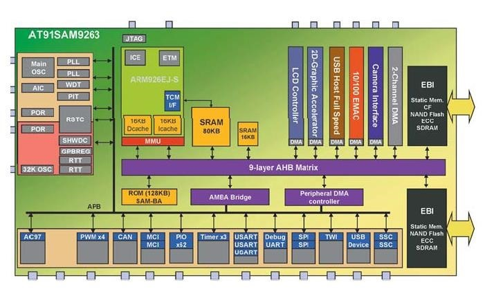

- It is transferred and receives the data serially bit by bit without class pulses. 
-  The UART takes bytes of data and sends the individual bits in a sequential manner.
- UART is a half-duplex protocol. 
- Half-duplex means transferring and receiving the data but not at the same time. 
- It uses a single data line for transmitting and receiving the data. It has one start bit, 8-bit data and onestop bit mean the 8-bit data transfer one’s signal is high to low.

## Application Background

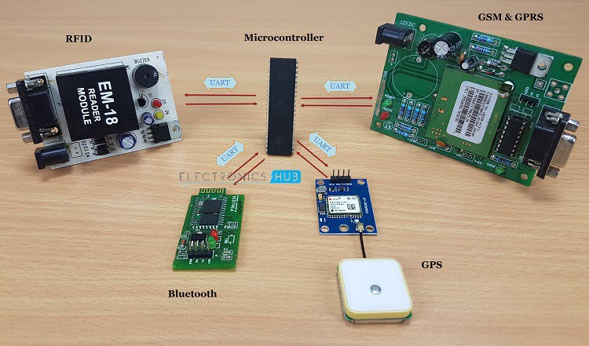

UART is one of the most simple and most commonly used Serial Communication techniques. Today, UART is being used in many applications like GPS Receivers, Bluetooth Modules, GSM and GPRS Modems, Wireless Communication Systems, RFID based applications etc.

# UART protocol data flow

These special bits are: Start bit, Priority bit, Stop bit.

**START BIT** :When a word is given to UART for asynchronous transmission, a bit called *“START BIT”* is added to the beginning of each word that is to be transmitted.
The start bit is used to alert the receiver that a word of data is about to sent, and to force the clock in the receiver into synchronization with the clock in the transmitter.

**DATA BIT OR DATA FRAME**: After the start bit, the individual bits of data are sent, with the least significant Bit(LSB) being sent first. Each bit in the transmission is transmitted for exactly the same amount of time as all of the other bits. And the receiver looks at the wire at approximately halfway through the period assigned to each bit to determine if the bit is 1 or 0. For example, if it takes 2 second to send each bit, the receiver will track the signal after 1 second has passed.

**PARITY BIT**: remove the problem of loss of some bits during the transmission of a signal, error correction mechanism must be added to the transmitted data. Parity bit error checking mechanism is one of the simplest methods to detect any error in received data. In asynchronous serial communication, a parity bit is added at the end of data bits to check the number of 1’s.

**STOP BIT**: At the end of each data packet, stop bit i.e. 1 is added to indicate the end of one data packet. At the receiver end, this stop bit is used to stop the reception of Data.

# How UART works

Two UARTs communicate directly with each other.
 - The transmitting UART converts parallel data from a controlling device like a CPU into serial form.

    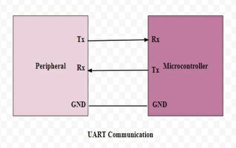

- Transmitting it in serial to the receiving UART.
 - Receiver UART then converts the serial data back into parallel data for the receiving device. 
 -  Only two wires are needed to transmit data between two UARTs.
 -  Data flows from TX pin of the transmitting UART to the Rx pin of the receiving UART.
 -  UART transmit data asynchronously, which means there is no need to transmit clock signal with the transmitted data. 
 -  Instead of clock, the transmitter transmit data with some special bits to synchronize the sending and receiving units. 
 -  These bits define the beginning and end of the data packet so the receiving UART knows when to start and stop reading the bits. 
 -  As soon as the start bit is detected, the receiver observe the start bit for 50[percent]of the receiving baud rate, if it is the receiver start sampling other data bits at the middle of each bit otherwise receiver set flag for framing error.
After detecting the 8 bit data, the receiver then looks for the parity bit which is generated by the transmitter for the single bit error detection. 
-  If the parity bit is detected properly, the receiver looks for the stop bit to stop the reception of data. 
-  After the successful detection of stop bit the receiver line goes high logic state to indicate idle state and start looking for the next start bit.

    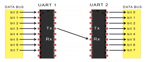

The UART that is going to transmit data receives the data from a data bus. The data bus is used to send data to the UART by another device like a CPU, memory, or microcontroller. Data is transferred from the data bus to the transmitting UART in parallel form. After the transmitting UART gets the parallel data from the data bus, it adds a start bit, a parity bit, and a stop bit, creating the data packet. Next, the data packet is output serially, bit by bit at the Tx pin.    

The receiving UART reads the data packet bit by bit at its Rx pin. The receiving UART then converts the data back into parallel form and removes the start bit, parity bit, and stop bits. Finally, the receiving UART transfers the data packet in parallel to the data bus on the receiving end:

## Verilog Implementation

This project is divided into 3 main modules for the easy and clear understanding and also for the ease in further development of project. **1.Baudrate generator 2. UART transmitter and 3. UART receiver**
- These 3 module are further divided into sub modules. 
-  All the modules are connected by instantiating each module in the main module.
## Baud rate generate

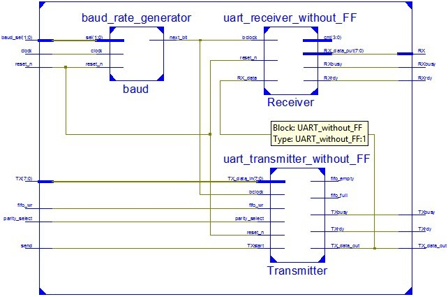

- Baud rate generator determines transmission speed in asynchronous communication. 
-  It is the number of symbols per second transferred. 
-  Each bit is 1/(baud rate) wide. 
-  Baud rate=clock freq./(16 divisor) Some standard baud rate:
-  2400 
-  9600 
-  19200
-  38400

     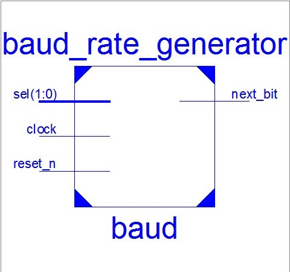

# Design of UART transmitter

- UART transmitter controls transmission by fetching a
data word in parallel format and directing the UART
to transmit it in a serial format

  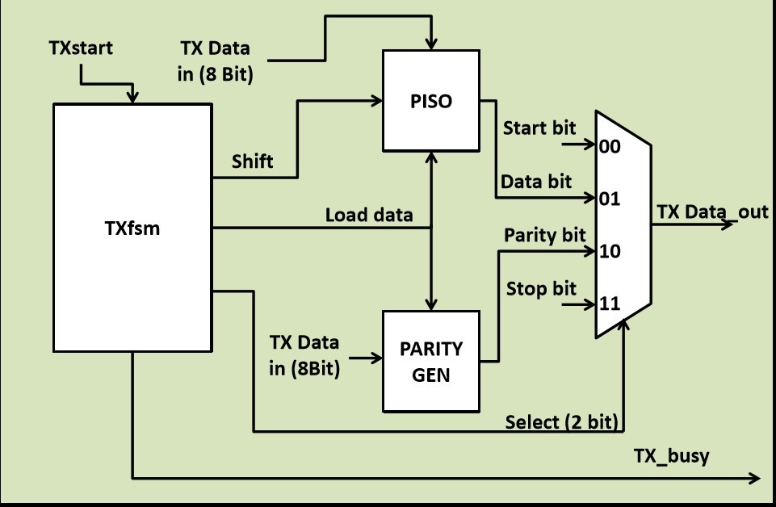

  - This module is further divided into 4 sub modules:- 
 1) **TX Controller fsm**: Generates all the necessary signal required to transmit data at right time 
 2) **Parity generator**: Generate parity for the 8 bit input data.
 3) **PISO(Parallel In Serial Out)**:Takes the 8 bit input binary data and convert it into 1 bit serial data.
 4) **Tx mux**: It is 4x1 Mux to transmit 4 different type of data viz.start bit, data bit, parity bit and the stop bit.

## Transmitter  state machine

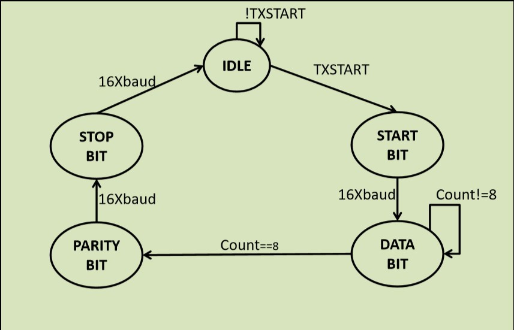

  *finite-state machine (FSM) or finitestate automaton (FSA)*
- It is an abstract machine that can be in exactly one of a finite
number of states at any given time. The FSM can change
from one state to another in response to some inputs; the
change from one state to another is called a transition. An
FSM is defined by a list of its states, its initial state, and the
inputs that trigger each transition.

 From the above figure we have to take two STATES for data shifting, given as follows
**1.present state and 2.next state**.

 Verilog implementation from above diagram.
 [click here](https://www.edaplayground.com/x/4jQu)

# Design of UART receiver
   The receiver, on the other hand, shifts in data bit by bit and then reassembles the data.Likewise, the Receiver must detect transmission, receive the data in serial format, strip of the start and stop bits, and store the data word in a parallel format. 

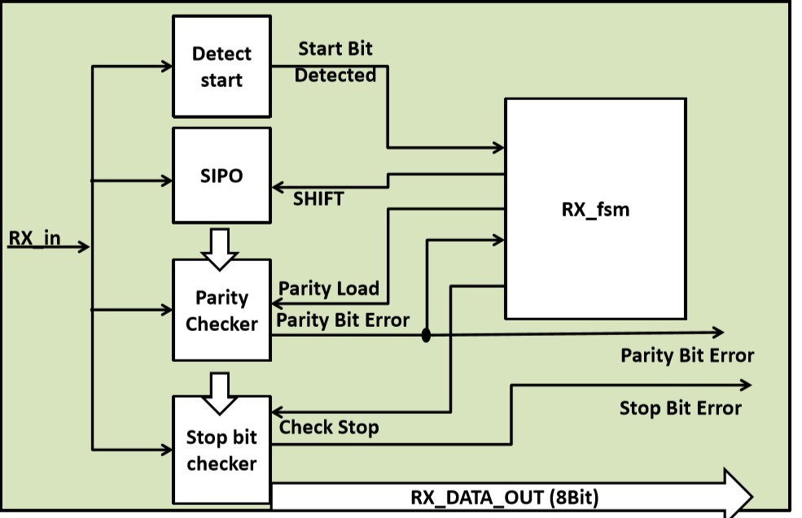

 This module is further divided into following sub modules:-
1) **RX fsm**: Generates all the control signals for the UART receiver.
 2. **Detect start**: Ideally the receiver receives continuous 1, as soon as the 0 is detected which is done by this module, the reception of data starts. 
 3. **SIPO**: Converts serial data into 8 bit parallel data.
 4.  **Parity checker**:Checks the correctness of data by Xoring the 10th received bit with xor value of 8 bit received data. 
 5. **Stop Bit checker**: After the detection of valid parity bit, the stop bit is detected, if the stop bit is not detected then reception of data is terminated by setting Stop bit error signal high.

## Receiver state machine
 From the below fig., we have to take two STATES for data shifting, given as follows **1.present state and 2.next state**.

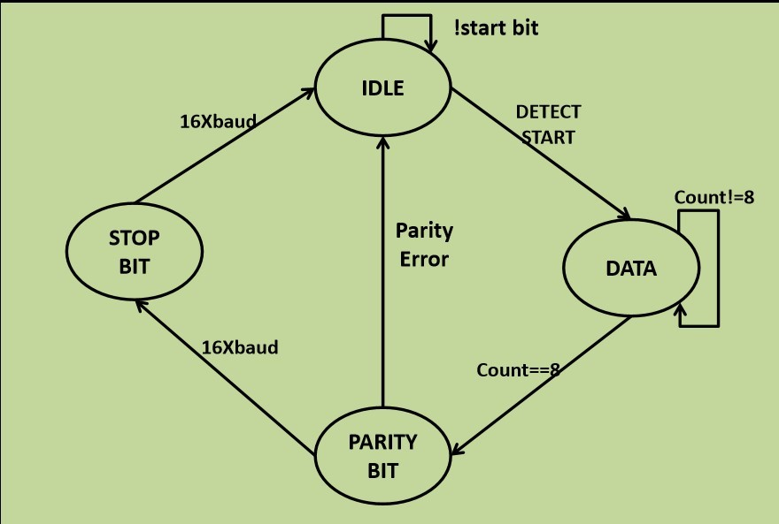

  Verilog implementation from above diagram. [click here](https://www.edaplayground.com/x/6Mk4)

 ## Oversampling procedure
 - The most commonly used sampling rate is 16 times
the baud rate, which means that each serial bit is
sampled 16 times.
- Assume that the communication uses N data bits
and M stop bits. The oversampling scheme works as follows:
1. Wait until the incoming signal becomes 0, the beginning of the start bit, and then start the sampling tick counter. 
2.  When the counter reaches 7, the incoming signal reaches the middle point of the start bit. Clear the counter to 0 and restart. 
3. When the counter reaches 15, the incoming signal progresses for one bit and reaches the middle of the    first data bit. Retrieve its value, shift it into a register, and restart the counter. 
4.  Repeat step 3 N-1 more times to retrieve the remaining data bits. 
5.  If the optional parity bit is used, repeat step 3 one time to obtain the parity bit. 
6.  Repeat step 3 M more times to obtain the stop bits.

# Results
## *Output Of Transmitter State machine*
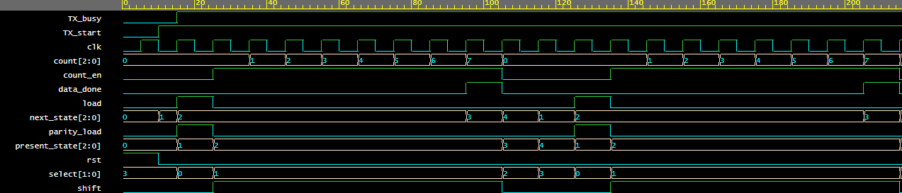

## *Output Of Receiver State machine*

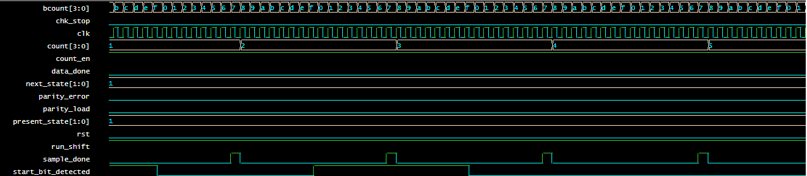

## *Final Output Of UART*

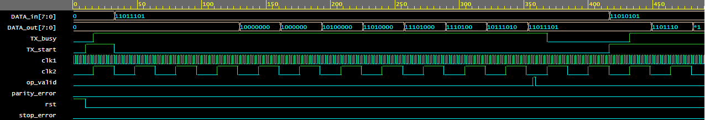

# Conclusion
UART protocol perfectly fits for communication with low speed device,i.e.This UART is a configurable programmable logic component that accommodates communication through a simple asynchronous serial interface. It allows a user to specify the system clock, baud rate, data length, parity scheme, and oversampling rate.

# Acknowledgement

I would like to thank our Institution for equipping us with Advanced VLSI Lab facilities to successfully execute our project. I am also grateful to our mentor, [Dr. Saroj Rout](https://www.linkedin.com/in/sroutk?lipi=urn%3Ali%3Apage%3Ad_flagship3_profile_view_base_contact_details%3BGPdq1QbhS6mnLJPpjzlEIQ%3D%3D) and  [Prof: Santunu sarangi](https://www.linkedin.com/in/santunu-sarangi-b731305b?lipi=urn%3Ali%3Apage%3Ad_flagship3_profile_view_base_contact_details%3Bg9BX%2F0YtQ0yyTenaLLJTog%3D%3D) for their constant advice and guidance throughout the project duration.

# References
[1] Semi Design  [click here](https://l.wl.co/l?u=http%3A%2F%2Fwww.semidesign.in)

[2] Electronic Hub  [click here](https://www.electronicshub.org/basics-uart-communication/)

[3] Wikipedia   [click here](https://www.codrey.com/embedded-systems/uart-serial-communication-rs232/#:~:text=UART%20%28Universal%20Asynchronous%20Transmitter%20Receiver%29%2C%20this%20is%20the,receives%20data%20from%20one%20system%20to%20another%20system.)
