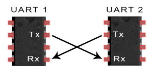

# UART-PROTOCOL
##  Raj Kumar Laldev 
 Advance VLSI Lab  Silicon institute of technology Bhubaneswar,India  
 rajbihar5364@gmail.com
 # Table of Contents
 - [Intrduction]()
  *  [Application Background]()
- [UART protocol data flow]()
- [How UART works]()
   * [Verilog Implementation]()
   * [Baud rate generate]()
- [Design of UART transmitter]()
  * [Transmitter  state machine]()
  * [Verilog implementation of state machine]()
- [Design of UART receiver]()
  * [Receiver state machine]()
  *  [Verilog implementation of state machine]()
- [Oversampling procedure]()
-  [Results]()
-  [Conclusion]()
- [Acknowledgement]()

# Intrduction
P
Rotocol: A set of rules and regulations is called a
protocol. Different type of protocols are available.
1.  Bus protocol: APB,AHB,AXI,ASB,ACE 
2. Peripheral protocol.
- High speed: PCIe, SATA, SAS, Ethernet, USB, MIPI.
- Low speed :UART,SPI,I2C.
An image: 