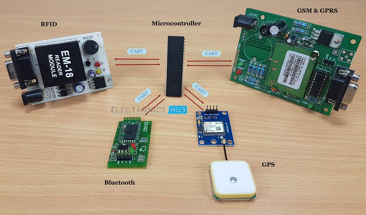
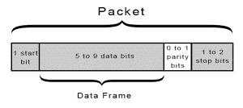

# UART-PROTOCOL
##  Raj Kumar Laldev 
 Advance VLSI Lab  Silicon institute of technology Bhubaneswar,India  
 rajbihar5364@gmail.com
 # Table of Contents
 - [Introduction](#Introduction)
  *  [Application Background](#Application Background )
- [UART protocol data flow](#UART protocol data flow )
- [How UART works](#How UART works)
   * [Verilog Implementation](#Verilog Implementation)
   * [Baud rate generate](#Baud rate generate)
- [Design of UART transmitter]()
  * [Transmitter  state machine]()
  * [Verilog implementation of state machine]()
- [Design of UART receiver]()
  * [Receiver state machine]()
  *  [Verilog implementation of state machine]()
- [Oversampling procedure]()
-  [Results]()
-  [Conclusion]()
- [Acknowledgement]()

# Introduction
Protocol: A set of rules and regulations is called a
protocol. Different type of protocols are available.
1.  Bus protocol: APB,AHB,AXI,ASB,ACE 
2. Peripheral protocol.
- High speed: PCIe, SATA, SAS, Ethernet, USB, MIPI.
- Low speed :UART,SPI,I2C.

   **Single wire connection** 

- One of the biggest challenge in SOC design is the on chip communication between the different components.
-  The different bus protocols used for interconnection .
-  Most of the times, the IP cores are designed with many different interfaces and communication protocols and this can be a problem while integrating into an SOC. 
- To avoid this problem, standard on-chip bus structures and protocols were developed. Exchange of information from one system to another system with a medium is called communication.
-  A set of rules and regulations that allow two electronic devices to connect to exchange the data with one and another. 
-  Universal asynchronous receiver-transmitter (UART) is one of the simplest and oldest forms of device-todevice digital communication. You can find UART devices as a part of integrated circuits (ICs) or as individual components.
-   UART stands for a universal asynchronous transmitter and receiver. 
-  UART Protocols is a serial communication with two wired protocols. 
- The data cable signal lines are labelled as Rx and Tx.
-   Serial communication is commonly used for transmitting and receiving the signal.

 **System on chip**   

- It is transferred and receives the data serially bit by bit without class pulses. 
-  The UART takes bytes of data and sends the individual bits in a sequential manner.
- UART is a half-duplex protocol. 
- Half-duplex means transferring and receiving the data but not at the same time. 
- It uses a single data line for transmitting and receiving the data. It has one start bit, 8-bit data and onestop bit mean the 8-bit data transfer one’s signal is high to low.

#  Application Background
 

UART is one of the most simple and most commonly used Serial Communication techniques. Today, UART is being used in many applications like GPS Receivers, Bluetooth Modules, GSM and GPRS Modems, Wireless Communication Systems, RFID based applications etc.

# UART protocol data flow

These special bits are: Start bit, Priority bit, Stop bit.
**START BIT** :When a word is given to UART for asynchronous transmission, a bit called *“START BIT”* is added to the beginning of each word that is to be transmitted.
The start bit is used to alert the receiver that a word of data is about to sent, and to force the clock in the receiver into synchronization with the clock in the transmitter.
**DATA BIT OR DATA FRAME**: After the start bit, the individual bits of data are sent, with the least significant Bit(LSB) being sent first. Each bit in the transmission is transmitted for exactly the same amount of time as all of the other bits. And the receiver looks at the wire at approximately halfway through the period assigned to each bit to determine if the bit is 1 or 0. For example, if it takes 2 second to send each bit, the receiver will track the signal after 1 second has passed.
**PARITY BIT**: remove the problem of loss of some bits during the transmission of a signal, error correction mechanism must be added to the transmitted data. Parity bit error checking mechanism is one of the simplest methods to detect any error in received data. In asynchronous serial communication, a parity bit is added at the end of data bits to check the number of 1’s.
**STOP BIT**: At the end of each data packet, stop bit i.e. 1 is added to indicate the end of one data packet. At the receiver end, this stop bit is used to stop the reception of Data.